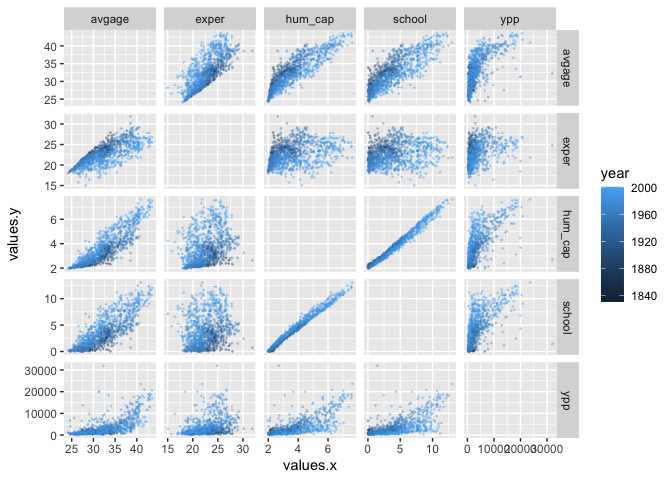

MA 615 Homework 8
================
Shivangi

For this HW we will use a dataset of historical economic data derived
from <http://www.jerrydwyer.com/growth/index.html>. The data variables
are described below and we’ll be investigating which variables can be
used to predict `ypp`, the output per-capita.

| Variable | Description                                       |
|:---------|:--------------------------------------------------|
| country  | Country Name                                      |
| region   | Region name                                       |
| year     | Year                                              |
| ypp      | Output Per-Capita                                 |
| school   | Years of Schooling (Avg.)                         |
| avgage   | Average Age (not Enrolled Under 65)               |
| exper    | Average Experience of Labor Force Participant     |
| hum_cap  | Level of Human Capital (Schooling and Experience) |
| lf2      | Labor Force                                       |
| pop      | Population                                        |
| sscap    | Steady State Capital Stock                        |
| kpw      | Capital Per Worker (Perpetual Inventory)          |
| lfpr     | Labor Force Particpation Rate                     |

## Question 1

``` r
suppressPackageStartupMessages(library(tidyverse))

econ <- 
  read_csv("historical_econ.csv", show_col_types = FALSE)

econ_updated <-
  econ %>% 
  select(-sscap, -kpw, -lf2) %>% 
  pivot_longer(cols = c("ypp", "school", "avgage", "exper", "hum_cap"), names_to = "names", values_to = "values")

econ_joined <-
  econ_updated %>% 
  full_join(econ_updated, by = c("country", "region", "year", "pop", "lfpr")) %>% 
  filter(names.x != names.y)

ggplot(econ_joined) +
  geom_point(aes(x = values.x, y = values.y, color = year), size = 0.25, alpha = 0.3) +
  facet_grid(names.y ~ names.x, scales = "free")
```

<!-- -->

This plot shows the relationship between each Variable with every other
variable. We can also see how this relationship changes with time. We
can notice a very clear linear relationship between level of human
capital and Average years of schooling. Here, Average years of schooling
and Level of Human Capital increases over time.

## Question 2

``` r
suppressPackageStartupMessages(library(leaps))

forwardSelection <-
  leaps::regsubsets(
    ypp ~ . -country -region -year,
    method = "forward",
    data = econ,
    nvmax = 10) %>% 
  summary()

forwardSelection$which
```

    ##   (Intercept) school avgage exper hum_cap   lf2   pop sscap  kpw  lfpr
    ## 1        TRUE  FALSE  FALSE FALSE   FALSE FALSE FALSE FALSE TRUE FALSE
    ## 2        TRUE  FALSE   TRUE FALSE   FALSE FALSE FALSE FALSE TRUE FALSE
    ## 3        TRUE  FALSE   TRUE FALSE    TRUE FALSE FALSE FALSE TRUE FALSE
    ## 4        TRUE  FALSE   TRUE  TRUE    TRUE FALSE FALSE FALSE TRUE FALSE
    ## 5        TRUE   TRUE   TRUE  TRUE    TRUE FALSE FALSE FALSE TRUE FALSE
    ## 6        TRUE   TRUE   TRUE  TRUE    TRUE FALSE FALSE  TRUE TRUE FALSE
    ## 7        TRUE   TRUE   TRUE  TRUE    TRUE  TRUE FALSE  TRUE TRUE FALSE
    ## 8        TRUE   TRUE   TRUE  TRUE    TRUE  TRUE  TRUE  TRUE TRUE FALSE
    ## 9        TRUE   TRUE   TRUE  TRUE    TRUE  TRUE  TRUE  TRUE TRUE  TRUE

``` r
index <- which.min(forwardSelection$cp)
colnames(forwardSelection$which)[forwardSelection$which[index,]]
```

    ## [1] "(Intercept)" "avgage"      "exper"       "hum_cap"     "kpw"

``` r
forwardSelection$cp
```

    ## [1] 527.939154 154.552666 132.791416   2.732017   3.444669   4.198543   6.002723
    ## [8]   8.000020  10.000000

``` r
fullModel <- lm(ypp ~ 1 -country -region -year, econ)
summary(fullModel)
```

    ## 
    ## Call:
    ## lm(formula = ypp ~ 1 - country - region - year, data = econ)
    ## 
    ## Residuals:
    ##     Min      1Q  Median      3Q     Max 
    ## -3216.4 -2440.7 -1546.2   554.1 28531.6 
    ## 
    ## Coefficients:
    ##             Estimate Std. Error t value Pr(>|t|)    
    ## (Intercept)   3437.4      128.7   26.72   <2e-16 ***
    ## ---
    ## Signif. codes:  0 '***' 0.001 '**' 0.01 '*' 0.05 '.' 0.1 ' ' 1
    ## 
    ## Residual standard error: 4001 on 966 degrees of freedom

``` r
bestModel <- lm(ypp ~ avgage + exper + hum_cap + kpw, econ)
summary(bestModel)
```

    ## 
    ## Call:
    ## lm(formula = ypp ~ avgage + exper + hum_cap + kpw, data = econ)
    ## 
    ## Residuals:
    ##      Min       1Q   Median       3Q      Max 
    ## -10639.8   -554.1    -42.9    501.6  10642.0 
    ## 
    ## Coefficients:
    ##               Estimate Std. Error t value Pr(>|t|)    
    ## (Intercept)  5.798e+03  1.078e+03   5.377 9.53e-08 ***
    ## avgage      -2.327e+03  2.171e+02 -10.720  < 2e-16 ***
    ## exper        2.153e+03  1.871e+02  11.505  < 2e-16 ***
    ## hum_cap      6.235e+03  5.144e+02  12.121  < 2e-16 ***
    ## kpw          1.283e-01  2.720e-03  47.159  < 2e-16 ***
    ## ---
    ## Signif. codes:  0 '***' 0.001 '**' 0.01 '*' 0.05 '.' 0.1 ' ' 1
    ## 
    ## Residual standard error: 1483 on 962 degrees of freedom
    ## Multiple R-squared:  0.8632, Adjusted R-squared:  0.8627 
    ## F-statistic:  1518 on 4 and 962 DF,  p-value: < 2.2e-16

## Question 3

``` r
suppressPackageStartupMessages(library(leaps))

backwardSelection <-
  leaps::regsubsets(
    ypp ~ . -country -region -year,
    method = "backward",
    data = econ,
    nvmax = 10) %>% 
  summary()

backwardSelection$which
```

    ##   (Intercept) school avgage exper hum_cap   lf2   pop sscap  kpw  lfpr
    ## 1        TRUE  FALSE  FALSE FALSE   FALSE FALSE FALSE FALSE TRUE FALSE
    ## 2        TRUE  FALSE  FALSE FALSE    TRUE FALSE FALSE FALSE TRUE FALSE
    ## 3        TRUE  FALSE  FALSE  TRUE    TRUE FALSE FALSE FALSE TRUE FALSE
    ## 4        TRUE  FALSE   TRUE  TRUE    TRUE FALSE FALSE FALSE TRUE FALSE
    ## 5        TRUE   TRUE   TRUE  TRUE    TRUE FALSE FALSE FALSE TRUE FALSE
    ## 6        TRUE   TRUE   TRUE  TRUE    TRUE FALSE FALSE  TRUE TRUE FALSE
    ## 7        TRUE   TRUE   TRUE  TRUE    TRUE  TRUE FALSE  TRUE TRUE FALSE
    ## 8        TRUE   TRUE   TRUE  TRUE    TRUE  TRUE  TRUE  TRUE TRUE FALSE
    ## 9        TRUE   TRUE   TRUE  TRUE    TRUE  TRUE  TRUE  TRUE TRUE  TRUE

``` r
index <- which.min(backwardSelection$cp)
colnames(backwardSelection$which)[backwardSelection$which[index,]]
```

    ## [1] "(Intercept)" "avgage"      "exper"       "hum_cap"     "kpw"

``` r
backwardSelection$cp
```

    ## [1] 527.939154 175.713853 115.385348   2.732017   3.444669   4.198543   6.002723
    ## [8]   8.000020  10.000000

``` r
fullModel <- lm(ypp ~ 1 -country -region -year, econ)
summary(fullModel)
```

    ## 
    ## Call:
    ## lm(formula = ypp ~ 1 - country - region - year, data = econ)
    ## 
    ## Residuals:
    ##     Min      1Q  Median      3Q     Max 
    ## -3216.4 -2440.7 -1546.2   554.1 28531.6 
    ## 
    ## Coefficients:
    ##             Estimate Std. Error t value Pr(>|t|)    
    ## (Intercept)   3437.4      128.7   26.72   <2e-16 ***
    ## ---
    ## Signif. codes:  0 '***' 0.001 '**' 0.01 '*' 0.05 '.' 0.1 ' ' 1
    ## 
    ## Residual standard error: 4001 on 966 degrees of freedom

``` r
bestModel <- lm(ypp ~ avgage + exper + hum_cap + kpw, econ)
summary(bestModel)
```

    ## 
    ## Call:
    ## lm(formula = ypp ~ avgage + exper + hum_cap + kpw, data = econ)
    ## 
    ## Residuals:
    ##      Min       1Q   Median       3Q      Max 
    ## -10639.8   -554.1    -42.9    501.6  10642.0 
    ## 
    ## Coefficients:
    ##               Estimate Std. Error t value Pr(>|t|)    
    ## (Intercept)  5.798e+03  1.078e+03   5.377 9.53e-08 ***
    ## avgage      -2.327e+03  2.171e+02 -10.720  < 2e-16 ***
    ## exper        2.153e+03  1.871e+02  11.505  < 2e-16 ***
    ## hum_cap      6.235e+03  5.144e+02  12.121  < 2e-16 ***
    ## kpw          1.283e-01  2.720e-03  47.159  < 2e-16 ***
    ## ---
    ## Signif. codes:  0 '***' 0.001 '**' 0.01 '*' 0.05 '.' 0.1 ' ' 1
    ## 
    ## Residual standard error: 1483 on 962 degrees of freedom
    ## Multiple R-squared:  0.8632, Adjusted R-squared:  0.8627 
    ## F-statistic:  1518 on 4 and 962 DF,  p-value: < 2.2e-16

## Question 4

Is the best model (according to `cp`) the same in Q2 and Q3?

That is true, the best model in question 2 and 3 is same

Are all of the selected predictors for backwards and forwards selection
the same for each number of predictors? If not which are different?

Selected predictors are not same each number of predictor.

``` r
tibble(names = names(backwardSelection$which[2,]),
       forward = forwardSelection$which[2,],
       backward = backwardSelection$which[2,])
```

    ## # A tibble: 10 × 3
    ##    names       forward backward
    ##    <chr>       <lgl>   <lgl>   
    ##  1 (Intercept) TRUE    TRUE    
    ##  2 school      FALSE   FALSE   
    ##  3 avgage      TRUE    FALSE   
    ##  4 exper       FALSE   FALSE   
    ##  5 hum_cap     FALSE   TRUE    
    ##  6 lf2         FALSE   FALSE   
    ##  7 pop         FALSE   FALSE   
    ##  8 sscap       FALSE   FALSE   
    ##  9 kpw         TRUE    TRUE    
    ## 10 lfpr        FALSE   FALSE

``` r
table(forwardSelection$which == backwardSelection$which)
```

    ## 
    ## FALSE  TRUE 
    ##     4    86

If you were to choose a model using just three predictors, which would
you choose?

I will choose the one with lowest cp. Backward Selection Model in this
case.

``` r
forwardSelection$cp[3]
```

    ## [1] 132.7914

``` r
backwardSelection$cp[3]
```

    ## [1] 115.3853

``` r
suppressPackageStartupMessages(library(modelr))
kcv <- 
  crossv_loo(econ) %>% 
  mutate(mod = map(train, 
                   ~lm(ypp ~ avgage + exper + hum_cap + kpw, data = .)
                   )) %>% 
  mutate(mse = map2_dbl(mod, test, mse))

mean(kcv$mse)/1000000
```

    ## [1] 2.426279

``` r
(mean(kcv$mse) + 1.96*sd(kcv$mse)/sqrt(nrow(econ)))/1000000
```

    ## [1] 3.177522

``` r
(mean(kcv$mse) - 1.96*sd(kcv$mse)/sqrt(nrow(econ)))/1000000
```

    ## [1] 1.675036
